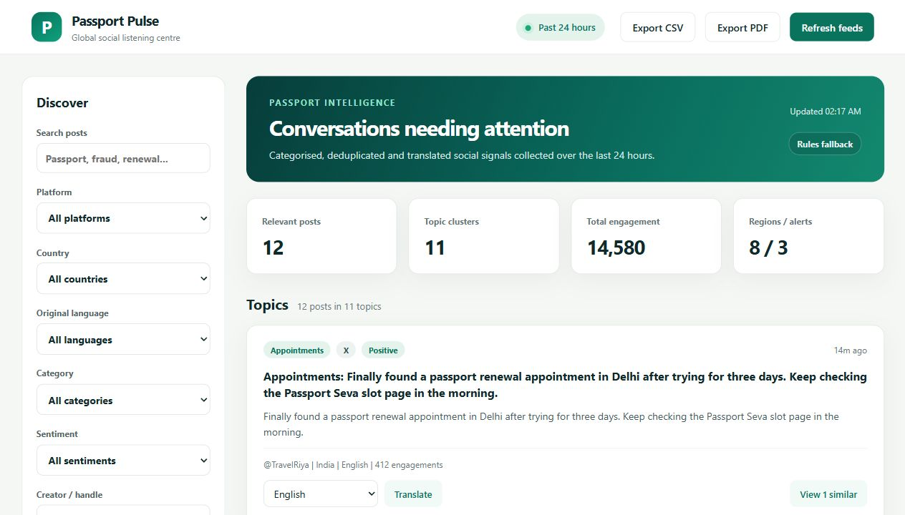
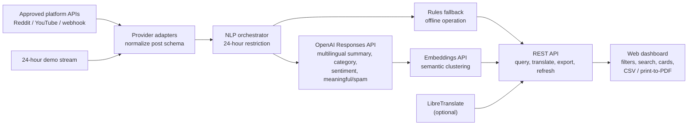

# Passport Pulse

Passport Pulse is a clean, multilingual social listening dashboard for passport-related discussions published in the past 24 hours. It processes collected posts into actionable topic clusters with spam removal, summaries, category and sentiment labels, translation, filters, search, and export.



## What Works

- A responsive dashboard with platform, country, original-language, category, sentiment, creator, engagement and time-order controls.
- Search across post text, summaries, and translations created during the session.
- Model-backed multilingual NLP when configured: factual 20-30 word summaries, topical classification, sentiment, meaningful/spam decisions, and embedding-based semantic clustering.
- Deterministic rule-based NLP fallback when no AI credential is configured, keeping the demo usable offline.
- One-click translation targets for English, Hindi, Punjabi, Spanish, French, German, Arabic, Chinese, Russian and Japanese.
- Export of the filtered view as CSV and browser-quality PDF (`Export PDF` opens the system print/PDF dialog).
- A refresh endpoint with live Reddit and YouTube connectors when configured, plus a normalized webhook for approved enterprise collectors.
- Dynamic demo data covering the required platforms, languages, topics and a filtered spam example, so reviewers can evaluate the full experience without credentials.

## Platform Access Reality

No application can legally fetch *all* public posts from every listed social platform without approved API access. X, Meta/Instagram, LinkedIn and TikTok gate broad public-content collection behind developer products, review and/or research agreements. This project therefore makes coverage explicit in the sidebar: `live` means a configured connector ran, while `demo` means representative processed records are shown.

For a production deployment, obtain the required platform approvals, implement approved adapters that return the normalized post shape in `src/providers.js`, or point `SOCIAL_INGEST_WEBHOOK` at an authorized collection service. The NLP and dashboard layers remain unchanged.

## Quick Start

Requirements: Node.js 18 or newer. There are no runtime npm dependencies.

```bash
npm start
```

Open [http://localhost:3000](http://localhost:3000).

Optional configuration variables are documented in `.env.example`. The server reads them from its runtime environment, as hosting platforms do; for example, run locally in PowerShell:

```powershell
$env:ENABLE_REDDIT="true"; npm start
```

To activate actual AI/NLP enrichment, provide an OpenAI API key before starting the app, then click **Refresh feeds**:

```powershell
$env:OPENAI_API_KEY="your-api-key"
$env:OPENAI_NLP_MODEL="gpt-5.4-mini"
$env:OPENAI_EMBEDDING_MODEL="text-embedding-3-small"
npm start
```

The dashboard label changes from `Rules fallback` to `AI enriched (...)` after a successful model-backed refresh. Post text is sent to the configured OpenAI API only when `OPENAI_API_KEY` is present.

## Architecture



## Data Flow

1. `POST /api/refresh` gathers configured live posts and regenerates rolling demo posts for offline evaluation.
2. Each normalized item is restricted to the last 24 hours. With `OPENAI_API_KEY`, the Responses API makes multilingual meaningful/spam decisions and generates an allowed category, sentiment and factual English summary for each post.
3. With AI enabled, embeddings group semantically similar posts even when written in different languages. Without credentials, local spam/category/sentiment/summary and token clustering rules are used as an explicit fallback.
4. `GET /api/posts` applies dashboard filters and sorting on processed posts, then produces clusters for the selected result set.
5. `POST /api/translate` uses a configured LibreTranslate service in production. In offline demo mode it returns a labelled glossary preview so all target-language interactions can be tested.
6. CSV export honors active filters. PDF uses a print-optimized dashboard stylesheet.

## API

OpenAPI documentation is in [`docs/openapi.yaml`](docs/openapi.yaml), and an importable Postman collection is in [`docs/Passport-Pulse.postman_collection.json`](docs/Passport-Pulse.postman_collection.json).

| Endpoint | Purpose |
| --- | --- |
| `GET /api/health` | Ingestion timestamp and accepted post count |
| `GET /api/meta` | Source coverage, languages and filter facets |
| `GET /api/posts` | Filtered, sorted topic clusters |
| `POST /api/refresh` | Run available connectors and reprocess results |
| `POST /api/translate` | Translate one post to a supported target language |
| `GET /api/export.csv` | Download filtered records |

## Quality And Scale

Run the unit tests:

```bash
npm test
```

The in-memory store is intentionally simple for a runnable demonstration. For production volumes, put raw posts in a queue (Kafka/SQS), run the model-backed enrichment asynchronously in workers, store posts and embeddings in PostgreSQL with `pgvector` or OpenSearch, cache translations, and paginate the API.

## Deployment

Deploy as a Node web service on Render, Railway, Fly.io, Azure App Service or similar:

1. Push this directory to a GitHub repository.
2. Create a web service using `npm start`, Node 18+, and expose port `3000` or the platform-provided `PORT`.
3. Add credentials as encrypted environment variables; never commit API keys.
4. Set `LIBRETRANSLATE_URL` for complete arbitrary-text translations and configure approved social-source access.

Creating a public GitHub repository and a publicly reachable demo requires the owner's GitHub and hosting account authorization; the application is ready for those two account-bound deployment steps.
